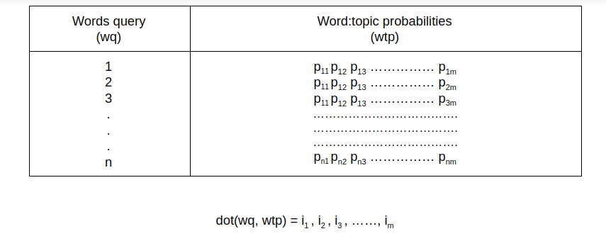
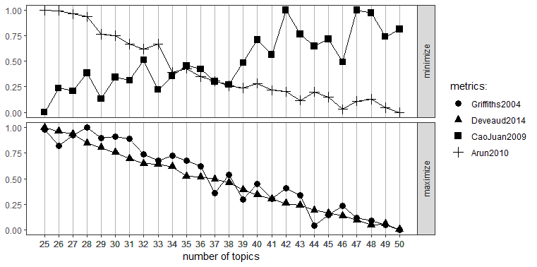

MP speeches topic model
================
Alexander Beatson

#### About

This project is a collaborative project with
[Phandeeyar](https://phandeeyar.org) and [The
Ananda](https://theananda.org). This implementation of topic model is to
enhance natural language processing, and advanced the word search engine
for the better search results.

#### Project goals

The primary goal of the project is to try to identify and promote access
to parliamentary data and digital documents, that would support the
engagement between the parliament and, civil society and the public
members. We would employ machine learning topic modelling techniques to
build a web app which enables users to search parliamentarians by
topics.  

#### How does it work

Input words are encoded by one-hot encoding vector form. Non-represent
words are padded with zeros. The dimension of words query (wq) is
(1,4015).  
The dot product with word to topic probabilities (twp) and words query
(wq) gives the results of how likely the topics will be in it.  

Then find the most similar document by finding the least residual
between the dot product and document to topic probability (dtp).  

arg min {MAE(dot(wq,wtp), dtp)}  

The last step is sorting the MPs those match with the documents in the
previous stage.  

##### Numbers of topic  

Chosing number of topics is not an easy step. The primary focus is both
reducing the complexity, and building topic capacity. These fours
algorithms are used to determine the numbers of topics.  
1\. Griffiths(2004)  
2\. Deveaud(2014)  
3\. CaoJuan(2009)  
4\. Arun(2010)  

#### Files

> root  

> > app.R : which has all the algorithms for the probablistic topic
> > modeling.  
> > dw.rds : R data system which stores topic and word probabilities  
> > mp\_lda.rds : S4 object contains topic model.  
> > mp\_table.rds : Table for MPs and documents  
> > personId : Table for MPs and unique person IDs.  

> logs  

> > logRecords.csv : store input queries for further analysis  

> src  

> > topic\_modeling.pdf : Full documentation of the project
> > topic\_number.png : Topic numbers plot
> > wq_wtp.png : dot product of wq and wtp

#### License

[MIT license](https://opensource.org/licenses/MIT)

#### Contributers

[Htin Kyaw Aye](https://github.com/htinkyawaye) 
